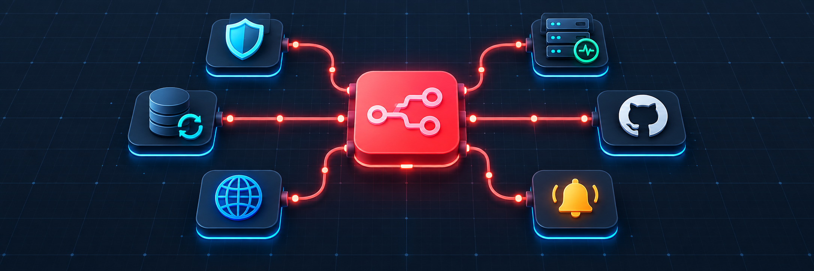

<p align="center">
  
</p>

<h1 align="center">Production n8n Workflows</h1>

<p align="center">
  Small, auditable automations for self-hosters and small teams.<br>
  Safe first runs, bounded retries, clear setup guides, and no exported credentials.
</p>

<p align="center">
  <a href="https://github.com/bugraskl/production-n8n-workflows/actions/workflows/validate.yml"></a>
  <a href="https://github.com/n8n-io/n8n/releases/tag/n8n%402.41.4"></a>
  <a href="LICENSE"></a>
  <a href="https://github.com/bugraskl/production-n8n-workflows/releases"></a>
</p>

## Why this collection exists

Most workflow collections optimize for volume. This one optimizes for trust: every workflow is intentionally small, documents its failure behavior, keeps secrets out of exported JSON, and can be reviewed before it is activated.

## Workflow catalog

| Workflow | Outcome | Setup | Services | Import |
|---|---|---:|---|---|
| [Service health monitor](docs/service-health-monitor.md) | Detects unhealthy Dockerized services through HTTP health endpoints | 5 min | HTTP, Discord-compatible webhook | [JSON](https://raw.githubusercontent.com/bugraskl/production-n8n-workflows/main/workflows/service-health-monitor.json) |
| [Domain and TLS monitor](docs/domain-tls-monitor.md) | Checks registration expiry and verifies that HTTPS/TLS works | 5 min | RDAP, HTTPS, webhook | [JSON](https://raw.githubusercontent.com/bugraskl/production-n8n-workflows/main/workflows/domain-tls-monitor.json) |
| [PostgreSQL backup verifier](docs/postgres-backup-verifier.md) | Requires fresh size, checksum, and restore-test evidence | 10 min | Backup job, webhook | [JSON](https://raw.githubusercontent.com/bugraskl/production-n8n-workflows/main/workflows/postgres-backup-verifier.json) |
| [GitHub release watcher](docs/github-release-watcher.md) | Alerts once when a tracked project publishes a release | 5 min | GitHub API, webhook | [JSON](https://raw.githubusercontent.com/bugraskl/production-n8n-workflows/main/workflows/github-release-watcher.json) |
| [Human-reviewed AI ticket triage](docs/human-reviewed-ai-ticket-triage.md) | Produces a classified draft and stops at a review queue | 10 min | OpenAI-compatible API, webhook | [JSON](https://raw.githubusercontent.com/bugraskl/production-n8n-workflows/main/workflows/human-reviewed-ai-ticket-triage.json) |
| [CVE security digest](docs/cve-security-digest.md) | Sends one daily digest of newly published high-severity CVEs | 5 min | NVD, webhook | [JSON](https://raw.githubusercontent.com/bugraskl/production-n8n-workflows/main/workflows/cve-security-digest.json) |
| [Domain expiry monitor](docs/domain-expiry-monitor.md) | Warns before domain registration expires | 5 min | RDAP, webhook | [JSON](https://raw.githubusercontent.com/bugraskl/production-n8n-workflows/main/workflows/domain-expiry-monitor.json) |
| [GitHub issue triage](docs/github-issue-triage.md) | Applies deterministic labels to new issues | 10 min | GitHub webhook and API | [JSON](https://raw.githubusercontent.com/bugraskl/production-n8n-workflows/main/workflows/github-issue-triage.json) |
| [Backup failure alert](docs/backup-failure-alert.md) | Normalizes backup events and alerts only on failure | 5 min | Any backup tool, webhook | [JSON](https://raw.githubusercontent.com/bugraskl/production-n8n-workflows/main/workflows/backup-failure-alert.json) |
| [Website change monitor](docs/website-change-monitor.md) | Keeps a private baseline and alerts when page text changes | 5 min | Public website, webhook | [JSON](https://raw.githubusercontent.com/bugraskl/production-n8n-workflows/main/workflows/website-change-monitor.json) |

## Quick start

1. Open a workflow's **JSON** link in the table and save the file.
2. In n8n, choose **Workflows → Import from File**.
3. Open the visible `Config` node and replace every placeholder.
4. Connect credentials when the guide asks for them. Credentials are never included in exports.
5. Execute manually once and inspect every output.
6. Activate only after the test run succeeds.

## What “production-ready” means here

- **No credential exports.** Authentication is connected after import.
- **Safe first run.** Stateful monitors establish a baseline instead of generating noise.
- **One visible Config node.** Important values are not scattered across the canvas.
- **Failure-aware.** Network calls use retries and bounded timeouts.
- **Human control for AI.** The AI workflow only drafts; it never sends a customer reply.
- **Least privilege.** The health monitor does not mount or expose the Docker socket.
- **Small enough to audit.** This is not a scraped “thousands of workflows” dump.

## Local validation

The included Compose file pins the n8n version used for schema validation:

```bash
cp .env.example .env
# Replace N8N_ENCRYPTION_KEY before first start.
docker compose up -d
```

Run the repository validator with:

```bash
npm test
```

It checks JSON syntax, required workflow fields, node and connection integrity, duplicate IDs and names, exported credential references, and common secret formats. GitHub Actions runs the same check on every push and pull request.

## Compatibility

Workflow exports use built-in nodes available in n8n 2.x and are maintained against `2.41.4`. External APIs can change; every guide documents the expected payload and upstream dependency.

## Contributing

Read [CONTRIBUTING.md](CONTRIBUTING.md). Production experience, reproducible bug reports, and small improvements are preferred over workflow count.

If one of these workflows saved you time, consider **starring the repository**. It helps other self-hosters discover a smaller, reviewable alternative to bulk workflow dumps.

## License

[MIT](LICENSE)
