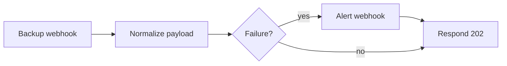

# Backup failure alert

A vendor-neutral webhook that accepts backup events, normalizes common status fields, alerts only on failure, and always returns a small JSON acknowledgement.



## Expected request

```json
{
  "status": "failed",
  "job": "postgres-nightly",
  "message": "upload timeout",
  "host": "db-01",
  "finished_at": "2026-09-30T02:14:00Z"
}
```

`status`, `state`, or `result` may be used. Values `success`, `succeeded`, `ok`, `completed`, and `complete` are treated as success; every other non-empty value is treated as failure.

## Setup

1. Import `workflows/backup-failure-alert.json`.
2. Set `alert_webhook_url` in `Config`.
3. Activate and copy the production webhook URL into your backup tool.
4. Send one successful and one failed sample before relying on it.
