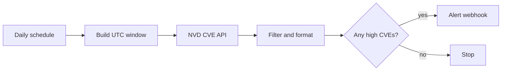

# CVE security digest

Fetches CVEs published during the previous 24 hours, keeps entries whose highest published CVSS score is at least 7.0, and sends one compact Markdown digest.

## Setup

1. Import `workflows/cve-security-digest.json`.
2. In `Config`, set `minimum_cvss`, `lookback_hours`, and `alert_webhook_url`.
3. Run manually. During quiet periods, temporarily lower `minimum_cvss` to test delivery.
4. Restore the threshold and activate.

The default webhook body is compatible with Discord. For Slack or another endpoint, edit only `Send Digest`.

## Operational notes

- The NVD API can be slow or rate-limited. The request retries three times with a 2-second delay.
- Results are capped in the message to stay below common webhook size limits.
- For higher request volume, add an NVD API key according to the official NVD API documentation.
