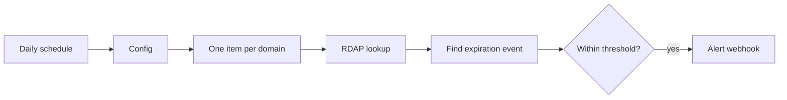

# Domain expiry monitor

Checks registration expiry through the RDAP bootstrap service and alerts when a domain crosses the configured threshold.

## Setup

1. Import `workflows/domain-expiry-monitor.json`.
2. Replace the sample domains in `Config`.
3. Set `warning_days` and `alert_webhook_url`.
4. Execute manually and inspect `Evaluate Expiry`.
5. Activate the daily schedule.

RDAP data quality depends on the registry. A domain with no recognizable expiration event is skipped rather than producing a false alert.
