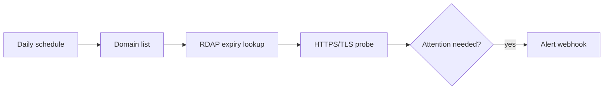

# Domain and TLS monitor

Combines a registration-expiry check through RDAP with a real HTTPS request. The HTTPS probe catches unreachable hosts, invalid certificate chains, hostname mismatches, and certificates that have already expired.

## Setup

1. Import `workflows/domain-tls-monitor.json`.
2. Replace the sample domains, warning threshold, and webhook URL in `Config`.
3. Execute manually and inspect `Evaluate Domain`.
4. Activate the schedule.

This workflow verifies whether TLS works now; it does not predict the certificate renewal date. Use a dedicated certificate inventory API when advance certificate-expiry warnings are required.
