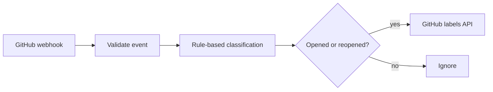

# GitHub issue triage

Receives GitHub issue webhooks and applies one deterministic label: `bug`, `documentation`, `question`, or `enhancement`. No issue text is sent to an AI provider.

## Setup

1. Import `workflows/github-issue-triage.json`.
2. Create a GitHub fine-grained token with **Issues: write** access only to the selected repositories.
3. In n8n create a **Header Auth** credential: header `Authorization`, value `Bearer YOUR_TOKEN`. Attach it to `Apply Label`.
4. Activate the workflow and copy its production webhook URL.
5. In the GitHub repository, add a webhook for **Issues** events with content type `application/json`.

The workflow builds API URLs only from GitHub's `repository.full_name` field after validating its format. Edit the keyword arrays in `Classify Issue` to match your project language.
