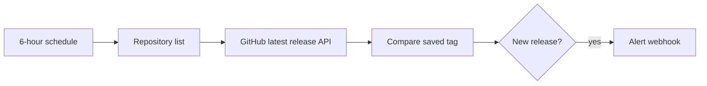

# GitHub release watcher

Checks public repositories through GitHub's releases API and sends one notification when the latest published release tag changes.

## Setup

1. Import `workflows/github-release-watcher.json`.
2. Replace the sample `owner/repository` entries and webhook URL in `Config`.
3. Run once to establish a private baseline. The first run intentionally sends no alerts.
4. Activate the workflow.

Public repositories work without authentication but are subject to GitHub's anonymous API rate limit. For larger lists, attach a GitHub credential in n8n instead of placing a token in the workflow.
