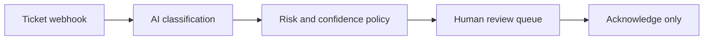

# Human-reviewed AI ticket triage

Classifies a support ticket, generates a draft response, and posts the result to a review channel. It never replies to the customer or mutates the ticketing system.

## Setup

1. Import `workflows/human-reviewed-ai-ticket-triage.json`.
2. On `AI Classification`, attach an n8n **Header Auth** credential that sends `Authorization: Bearer YOUR_KEY`. Do not paste the key into the workflow.
3. Choose the model, confidence threshold, and review webhook in `Config`.
4. POST a sample ticket containing `id`, `subject`, and `body` to the test webhook URL.
5. Confirm that only a draft appears in the review channel.
6. Activate the workflow and connect the production webhook to the ticket source.

The workflow intentionally ends at a human queue. Add a separate, audited approval workflow before connecting any customer-visible reply action.
