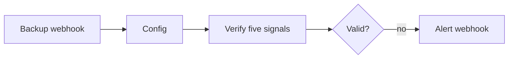

# PostgreSQL backup verifier

Receives a completion event from a PostgreSQL backup job and treats a backup as valid only when its status, size, age, checksum, and restore test all pass.



## Expected payload

```json
{
  "database": "app_production",
  "status": "success",
  "size_bytes": 73400320,
  "completed_at": "2026-09-30T08:15:00Z",
  "checksum_ok": true,
  "restore_test_ok": true
}
```

## Setup

1. Import `workflows/postgres-backup-verifier.json`.
2. Set the size and age thresholds plus `alert_webhook_url` in `Config`.
3. Configure the backup job to POST the payload above to the production webhook URL.
4. Send one known-good and one deliberately failing test event.
5. Activate the workflow only after both paths behave as expected.
