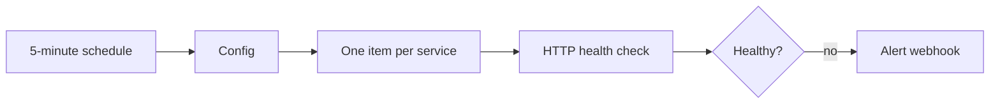

# Service health monitor

Checks the HTTP health endpoints exposed by Dockerized services and sends an alert when an endpoint is unavailable or returns a non-success status.

## Setup

1. Make each container expose an HTTP health endpoint through your reverse proxy or private network.
2. Import `workflows/service-health-monitor.json`.
3. Replace the sample names, URLs, and `alert_webhook_url` in `Config`.
4. Execute manually and verify the status produced by `Evaluate Health`.
5. Activate the schedule.

The workflow deliberately avoids mounting the Docker socket into n8n. A read-only health endpoint is easier to audit and does not give the automation service control over the Docker daemon.
