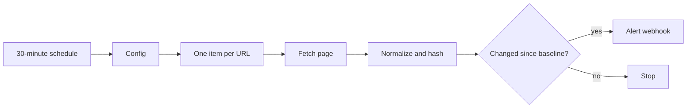

# Website change monitor

Fetches a list of public pages, normalizes whitespace, stores only a compact hash in n8n workflow static data, and alerts when the hash changes.

## Setup

1. Import `workflows/website-change-monitor.json`.
2. Replace the sample URLs and `alert_webhook_url` in `Config`.
3. Run the workflow manually once. The first run creates the baseline and sends no alerts.
4. Run a second time to confirm `changed` is `false`.
5. Activate the workflow.

## Behavior

- Only normalized text and a hash are used for comparison; full pages are not kept in workflow static data.
- Whitespace-only changes do not alert.
- Each URL has an independent baseline.
- Redirects are followed by the HTTP Request node.
- A failed request does not replace a valid baseline.

This intentionally monitors the whole response body. Pages with rotating timestamps, ads, CSRF tokens, or randomized markup may produce noise. For those pages, insert an HTML extraction node before `Compare With Baseline` and hash only the stable section you care about.
